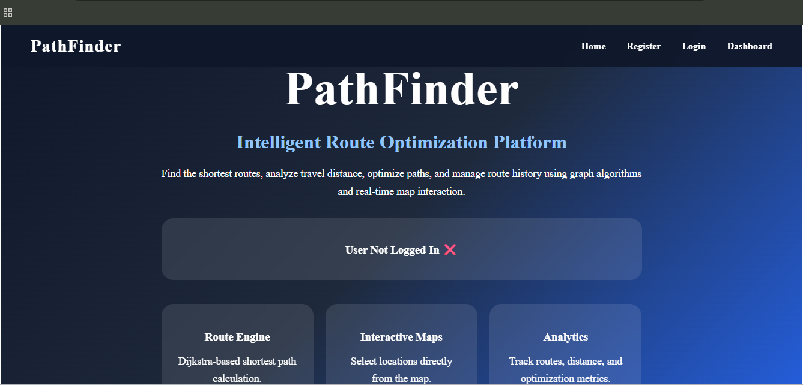
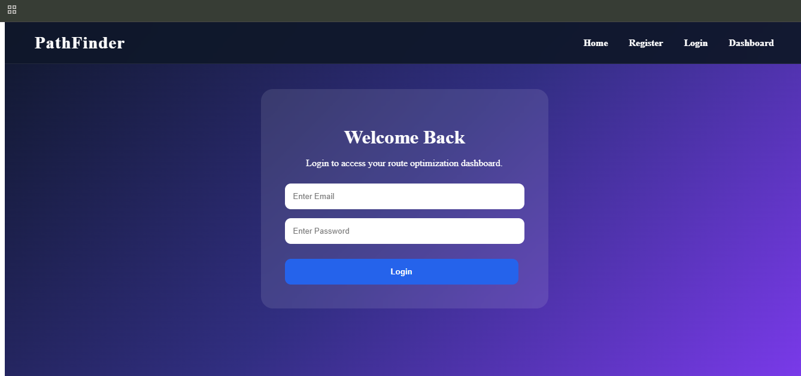
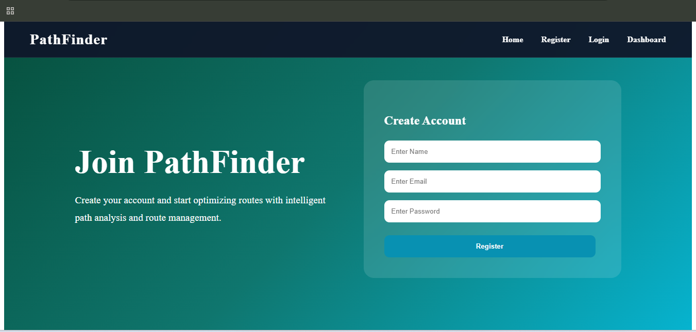
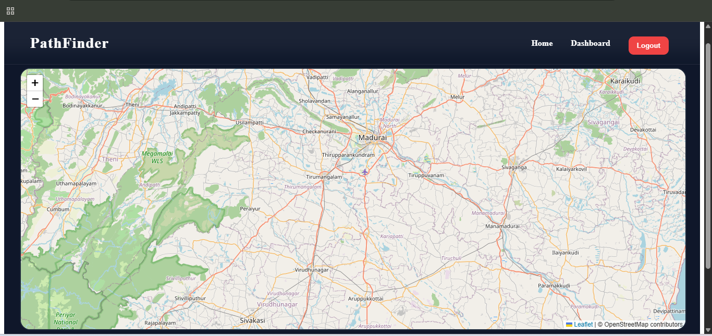

# 🚀 PathFinder - Intelligent Route Optimization Platform

## 📌 Overview

PathFinder is a full-stack route optimization platform that helps users calculate the shortest route between locations using graph algorithms. The application provides route calculation, route history tracking, analytics, authentication, and an interactive map-based user interface.

This project was built to strengthen skills in:

* React.js
* Node.js
* Express.js
* PostgreSQL
* JWT Authentication
* Graph Algorithms (Dijkstra's Algorithm)
* REST API Development
* Interactive Maps

---

## ✨ Features

### 🔐 Authentication System

* User Registration
* User Login
* JWT Token Authentication
* Protected Dashboard Routes
* Logout Functionality

### 🗺️ Interactive Maps

* OpenStreetMap Integration
* Location Selection
* Dynamic Marker Placement

### ⚡ Route Optimization

* Dijkstra's Algorithm Implementation
* Shortest Path Calculation
* Distance Calculation
* Path Reconstruction

### 📊 Analytics Dashboard

* Total Routes Calculated
* Total Distance Traveled
* Latest Route Information

### 🗄️ Route History

* Store Route History
* Retrieve Previous Routes
* Persistent PostgreSQL Storage

---

## 🛠️ Tech Stack

### Frontend

* React.js
* React Router DOM
* Axios
* React Leaflet
* CSS3
* Vite

### Backend

* Node.js
* Express.js
* PostgreSQL
* JWT
* bcrypt

### Database

* PostgreSQL

### Algorithms

* Dijkstra's Shortest Path Algorithm

---

## 📷 Project Screenshots

### Landing Page



### Login Page



### Register Page



### Dashboard



### Analytics


---

## 🚀 Installation

### Clone Repository

```bash
git clone <repository-url>
```

### Install Dependencies

```bash
npm install
```

### Run Development Server

```bash
npm run dev
```

---

## 🧠 Challenges Faced

### 1. Authentication Flow

Implementing secure login and registration using JWT authentication.

### 2. Route Protection

Preventing unauthorized users from accessing dashboard pages.

### 3. Dijkstra Algorithm Integration

Connecting graph-based shortest path calculations with frontend route visualization.

### 4. Database Integration

Storing and retrieving route history using PostgreSQL.

### 5. Frontend-Backend Communication

Managing API requests and handling responses efficiently.

---

## 💡 How These Challenges Were Solved

### Authentication

Implemented JWT-based authentication and protected routes.

### Database

Used PostgreSQL with route history tables and API integration.

### Route Optimization

Implemented Dijkstra's Algorithm with path reconstruction.

### UI Improvements

Designed responsive pages with a clean user experience.

---

## 🔮 Future Enhancements

* Real GPS-Based Routing
* Google Maps API Integration
* Live Traffic Analysis
* Route Visualization on Map
* Multi-Stop Route Optimization
* Distance Matrix Support
* User Profile Management
* Route Export Functionality
* Dark / Light Theme Toggle
* Mobile Responsive Enhancements

---

## 📚 Key Learnings

Through this project, I gained practical experience in:

* Full Stack Development
* Authentication Systems
* REST API Design
* PostgreSQL Database Management
* Graph Algorithms
* React State Management
* Git & GitHub Workflow
* Project Deployment Preparation

---

## 👨‍💻 Author

**Mohammed Yehaya**

Built as a portfolio project to demonstrate full-stack development, algorithm implementation, and modern web application architecture.

